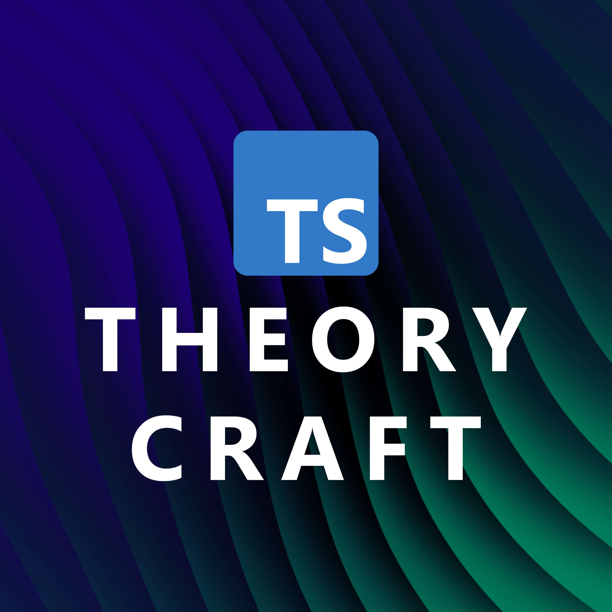

  

<h1 align="center">TypeScript TheoryCrafting</h1>

This repo holds examples for [Michigan TypeScript TheoryCraft](https://www.youtube.com/watch?v=4CmGe7VH_zg&list=PLOlZuxYbPik3eOemMR8s88rY_lhMivyVu&pp=iAQB) videos.  If you have an idea for something, feel free to submit a PR.  Then make sure to follow up on the #theorycraft channel on the [MiTS discord](https://discord.michigantypescript.com).

## Episodes

- [that one weird trick to access array values: `T[number]`](./episodes/t-number)
- [`assertUnreachable` techniques with Ryan from the TypeScript team](./episodes/assert-unreachable)
